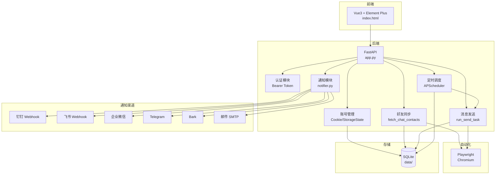

# Douyin Spark Fusion (Self-Hosted)

抖音火花自动续期融合方案 — 自托管 Web 应用，基于 FastAPI + Vue3 + Element Plus。

## 特性

- **双模式登录**: StorageState JSON 文件上传 + Cookie JSON 数组导入
- **好友查找**: 5 层搜索回退策略 + 空间边界框验证
- **消息发送**: 文字/图片/表情/随机 四种消息类型 + 模板占位符系统
- **限流保护**: 12 关键词检测 + 自动冷却重试
- **多账号管理**: 账号隔离 + 独立 Cookie/StorageState
- **多用户系统**: 管理员/普通用户 + Bearer Token 认证
- **定时任务**: APScheduler + Cron 表达式 + 动态管理
- **通知**: 钉钉 / 飞书 / 企业微信 / Telegram / Bark / 邮件 — 7 渠道统一通知
- **一键部署**: deploy.sh + systemd + nginx

## 系统架构



## 快速开始

### 一键部署

```bash
sudo bash deploy.sh
```

### 手动安装

```bash
python3 -m venv .venv
source .venv/bin/activate
pip install -r requirements.txt
playwright install --with-deps chromium
python app.py
```

### 默认管理员

- 用户名: `admin`
- 密码: `spark2024`

## 配置

### 环境变量 (.env)

| 变量 | 说明 | 默认值 |
|------|------|--------|
| PORT | 服务端口 | 8000 |
| HOST | 监听地址 | 0.0.0.0 |
| HEADLESS | 无头模式 | true |
| AUTH_TOKEN | 访问令牌 | 自动生成 |
| DINGTALK_WEBHOOK | 钉钉机器人 Webhook | - |
| DINGTALK_SECRET | 钉钉机器人密钥 | - |
| FEISHU_WEBHOOK | 飞书机器人 Webhook | - |
| FEISHU_SECRET | 飞书机器人密钥 | - |
| WECOM_WEBHOOK | 企业微信机器人 Webhook | - |
| TELEGRAM_BOT_TOKEN | Telegram Bot Token | - |
| TELEGRAM_CHAT_ID | Telegram Chat ID | - |
| BARK_DEVICE_KEY | Bark 设备 Key | - |
| BARK_URL | Bark 服务器地址 | https://api.day.app |
| SMTP_HOST | 邮件 SMTP 服务器 | - |
| SMTP_PORT | 邮件 SMTP 端口 | 465 |
| SMTP_USER | 邮件账号 | - |
| SMTP_PASS | 邮件密码 | - |
| MAIL_TO | 邮件接收人 | - |
| ALLOW_REGISTRATION | 允许注册 | true |

### 系统设置 (Web 控制台)

| 设置 | 说明 | 默认值 |
|------|------|--------|
| schedule_time | 每日发送时间 | 21:00 |
| jitter_minutes | 时间抖动窗口(分钟) | 30 |
| send_gap_min | 好友间隔最小(秒) | 6 |
| send_gap_max | 好友间隔最大(秒) | 12 |
| max_friends_per_run | 每次最多发送人数 | 20 |
| daily_limit | 每日发送上限 | 50 |
| rate_limit_cooldown_minutes | 限流冷却(分钟) | 45 |
| retry_delay_minutes | 失败重试延迟(分钟) | 45 |

## 消息模板占位符

在消息内容中可使用以下占位符：

- `{{friend}}` - 好友名称
- `{{account}}` - 账号名称
- `{{date}}` - 当前日期 (YYYY-MM-DD)
- `{{time}}` - 当前时间 (HH:MM)
- `{{weekday}}` - 当前星期
- `{{spark_days}}` - 火花天数
- `{{yiyan}}` - 一言内容
- `{{from}}` - 一言来源

## API 端点

| 方法 | 路径 | 说明 |
|------|------|------|
| GET | /api/health | 健康检查 |
| POST | /api/auth/login | 登录 |
| POST | /api/auth/register | 注册 |
| GET | /api/auth/me | 当前用户 |
| GET | /api/accounts | 账号列表 |
| POST | /api/accounts | 创建账号 |
| PUT | /api/accounts/:id | 更新账号 |
| DELETE | /api/accounts/:id | 删除账号 |
| POST | /api/accounts/:id/cookies | 上传 Cookie |
| POST | /api/accounts/:id/storage-state | 上传 StorageState |
| POST | /api/accounts/:id/verify-login | 验证登录 |
| GET | /api/friends | 好友列表 |
| POST | /api/friends/sync | 同步好友 |
| POST | /api/messages/send | 发送消息 |
| POST | /api/messages/preview | 预览模板 |
| GET | /api/tasks | 任务列表 |
| POST | /api/tasks | 创建任务 |
| PUT | /api/tasks/:id | 更新任务 |
| DELETE | /api/tasks/:id | 删除任务 |
| POST | /api/tasks/:id/run | 执行任务 |
| POST | /api/tasks/run-all | 执行所有任务 |
| GET | /api/logs | 日志列表 |
| GET | /api/settings | 获取设置 |
| POST | /api/settings | 更新设置(管理员) |
| GET | /api/stats | 统计数据 |
| GET | /api/admin/users | 用户列表(管理员) |
| DELETE | /api/admin/users/:id | 删除用户(管理员) |

## 项目结构

```
fusion-selfhosted/
├── app.py              # FastAPI 入口
├── core/
│   ├── automation.py   # Playwright 自动化
│   ├── config.py       # 配置管理
│   ├── models.py       # 数据库模型
│   ├── notifier.py     # 通知模块（7 渠道）
│   └── scheduler.py    # 定时调度
├── static/
│   └── index.html      # Vue3 前端
├── data/               # 数据目录
├── deploy.sh           # 部署脚本
├── requirements.txt    # Python 依赖
└── README.md           # 文档
```

## 安全说明

- Cookie 和 StorageState 以 JSON 格式存储在 SQLite 数据库中
- 密码使用 SHA256 哈希存储
- Bearer Token 认证，令牌 32 字节随机生成
- 日志脱敏：好友名称使用别名替换
- 安全诊断：仅收集元素属性，不读取 innerText/innerHTML
- 无 eval()：使用 json.loads() 解析
- 无硬编码密码：管理员密码可通过环境变量或 Web 控制台修改

## 许可证

MIT